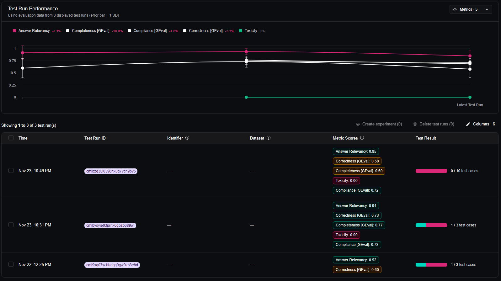

# Financial Advisor LLM Evaluation Framework

A robust, modular pipeline for automated LLM chatbot evaluation, using [DeepEval](https://github.com/confident-ai/deepeval), GROQ models, and Confident AI dashboard logging. Designed for **systematic QA**, reliable evaluation, and portfolio-quality results in AI/QA engineering.

---

## 🚀 Features

- Modular architecture: chatbot, custom judge LLM, metrics, and batch orchestration are all decoupled and testable.
- Supports strict schema-enforced LLM output with Pydantic and GROQ Structured Outputs.
- Automated evaluation with classic metrics: **Relevancy, Correctness, Completeness, Compliance, Toxicity**.
- Golden test-case driven: generates, evaluates, and tracks results using real-life user questions.
- CI/CD and portfolio-ready; integrates results with [Confident AI dashboard](https://app.confident-ai.com).

---

## 📂 Project Structure

├── src/
│ ├── chatbot.py # FinancialAdvisorChatbot for all user queries
│ ├── metrics.py # CustomGROQLLM + DeepEval metric functions
│
├── scripts/
│ ├── batch_evaluation.py # Main evaluation runner (calls everything)
│
├── test_cases/
│ ├── golden_test_cases.json # List of user questions + expected outputs
│
├── .env # API keys etc. (never check in secrets)
├── README.md # This file

---

## ⚡️ Getting Started

### 1. Clone and install

git clone https://github.com/a5hit/FinChatbot_Eval.git
cd FinChatbot_Eval
pip install -r requirements.txt

### 2. Configure your environment

Create a `.env` file:

GROQ_API_KEY=sk-...
CONFIDENT_API_KEY=confident-...

- Get a [GROQ API key](https://console.groq.com/api-keys)
- Get a [Confident AI key](https://app.confident-ai.com)

### 3. Prepare your test cases

Edit or extend `test_cases/golden_test_cases.json` using this format:

[
{
"query": "What is a 401(k)?",
"expected_output": "A 401(k) is a retirement savings plan...",
"context": "Retirement basics"
}
]

### 4. Run the batch evaluation

python scripts/batch_evaluation.py --chatbot-model llama-3.1-8b-instant --eval-model llama-3.1-8b-instant

---

## 🧑‍💻 How It Works

1. **Load golden test cases:** All test data sourced from `golden_test_cases.json`
2. **Generate answers:** `FinancialAdvisorChatbot` produces an actual output for each query.
3. **Evaluate answers:** Each answer is scored using multiple DeepEval metrics, with responses judged by your `CustomGROQLLM`.
4. **Visualize and track:** Results are printed to the console and logged to [Confident AI dashboard](https://app.confident-ai.com).

### Example Metric Output

- Answer Relevancy: 0.94
- Correctness: 0.73
- Completeness: 0.77
- Toxicity: 0.00
- Compliance: 0.73

All scores appear in your dashboard for trend analysis and export.

---

## 📝 Key Files

| File/Folder                     | Purpose                                |
|---------------------------------|----------------------------------------|
| `src/chatbot.py`                | Chatbot LLM that generates answers     |
| `src/metrics.py`                | Judge LLM & metric factories           |
| `scripts/batch_evaluation.py`   | Pipeline orchestration & CLI           |
| `test_cases/golden_test_cases.json` | Golden test case data                |
| `.env`                          | API Keys (DO NOT COMMIT)               |

---

## 📊 Results and Dashboard

All evaluation runs are automatically logged and can be visualized in the [Confident AI Dashboard](https://app.confident-ai.com).  
Use this dashboard to analyze trends, export results, and compare models.

---

## 🛡️ Responsible AI

- All evaluation logic follows best practices for compliance, non-harmful advice, and transparency.
- No advice output should be considered financial advice; always consult a professional for real decisions.

---

## 🤝 Contributing

Pull requests, feedback, and discussions are welcome!  
See `CONTRIBUTING.md` (if using) or open an issue.

---

## 📚 Further Reading

- [DeepEval Documentation](https://docs.confident-ai.com/core-guides/llm-evals)
- [GROQ Structured Outputs](https://console.groq.com/docs/structured-outputs)
- [Confident AI Dashboard](https://app.confident-ai.com)
- [Prompt Engineering for LLM QA](https://www.promptingguide.ai/)

---

## 🔖 License

MIT

---

**Built for learning, clarity, and production-grade QA of LLMs for real-world tasks.**  
If you use this project for work, research, or interviews, please credit the template and authors.
